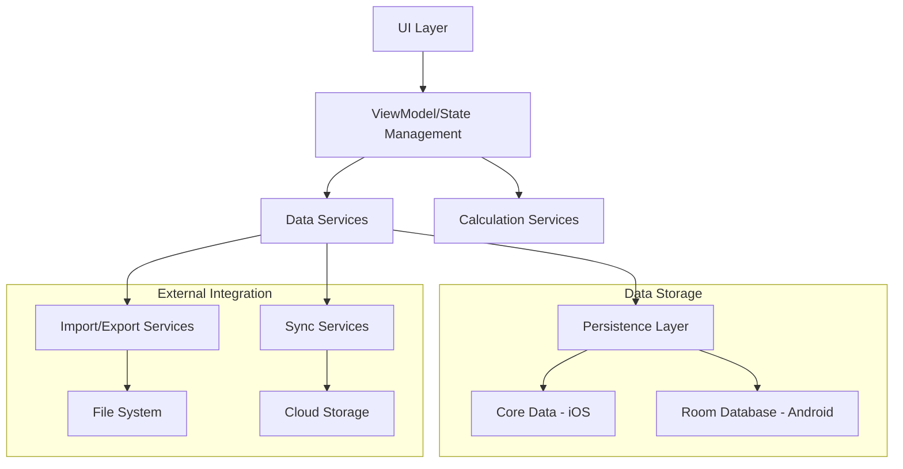
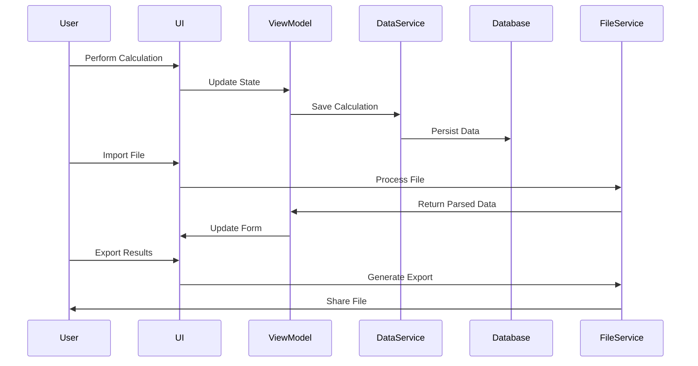

# Design Document

## Overview

The Enhanced Data Management feature transforms the IRR Genius app from a session-based calculator into a comprehensive financial analysis tool with persistent storage, improved user experience, and flexible data import/export capabilities. This design builds upon the existing calculation engine while adding robust data management layers for both iOS and Android platforms.

The solution introduces a three-tier architecture: a data persistence layer using Core Data (iOS) and Room (Android), an enhanced UI layer with improved navigation and state management, and a data import/export service layer supporting multiple file formats.

## Architecture

### High-Level Architecture



### Data Flow Architecture



## Components and Interfaces

### 1. Data Models

#### Enhanced Calculation Model
```swift
// iOS
struct SavedCalculation: Identifiable, Codable {
    let id: UUID
    let name: String
    let calculationType: CalculationMode
    let createdDate: Date
    let modifiedDate: Date
    let projectId: UUID?
    
    // Calculation inputs (varies by type)
    let initialInvestment: Double?
    let outcomeAmount: Double?
    let timeInMonths: Double?
    let irr: Double?
    let followOnInvestments: [FollowOnInvestment]?
    
    // Results
    let calculatedResult: Double?
    let growthPoints: [GrowthPoint]?
    
    // Metadata
    let notes: String?
    let tags: [String]
}

struct Project: Identifiable, Codable {
    let id: UUID
    let name: String
    let description: String?
    let createdDate: Date
    let modifiedDate: Date
    let color: String? // Hex color for UI
}
```

```kotlin
// Android
@Entity(tableName = "saved_calculations")
data class SavedCalculation(
    @PrimaryKey val id: String = UUID.randomUUID().toString(),
    val name: String,
    val calculationType: CalculationMode,
    val createdDate: LocalDateTime,
    val modifiedDate: LocalDateTime,
    val projectId: String?,
    
    // Calculation inputs
    val initialInvestment: Double?,
    val outcomeAmount: Double?,
    val timeInMonths: Double?,
    val irr: Double?,
    
    // Results
    val calculatedResult: Double?,
    
    // Metadata
    val notes: String?,
    val tags: String? // JSON array as string
)

@Entity(tableName = "projects")
data class Project(
    @PrimaryKey val id: String = UUID.randomUUID().toString(),
    val name: String,
    val description: String?,
    val createdDate: LocalDateTime,
    val modifiedDate: LocalDateTime,
    val color: String?
)
```

### 2. Data Persistence Layer

#### iOS - Core Data Implementation
```swift
protocol CalculationRepository {
    func saveCalculation(_ calculation: SavedCalculation) async throws
    func loadCalculations() async throws -> [SavedCalculation]
    func loadCalculation(id: UUID) async throws -> SavedCalculation?
    func deleteCalculation(id: UUID) async throws
    func searchCalculations(query: String) async throws -> [SavedCalculation]
    func loadCalculationsByProject(projectId: UUID) async throws -> [SavedCalculation]
}

class CoreDataCalculationRepository: CalculationRepository {
    private let container: NSPersistentContainer
    
    // Implementation with Core Data operations
}
```

#### Android - Room Database Implementation
```kotlin
@Dao
interface CalculationDao {
    @Query("SELECT * FROM saved_calculations ORDER BY modifiedDate DESC")
    suspend fun getAllCalculations(): List<SavedCalculation>
    
    @Query("SELECT * FROM saved_calculations WHERE id = :id")
    suspend fun getCalculationById(id: String): SavedCalculation?
    
    @Insert(onConflict = OnConflictStrategy.REPLACE)
    suspend fun insertCalculation(calculation: SavedCalculation)
    
    @Delete
    suspend fun deleteCalculation(calculation: SavedCalculation)
    
    @Query("SELECT * FROM saved_calculations WHERE name LIKE :query OR notes LIKE :query")
    suspend fun searchCalculations(query: String): List<SavedCalculation>
}

@Database(
    entities = [SavedCalculation::class, Project::class, FollowOnInvestmentEntity::class],
    version = 1
)
abstract class AppDatabase : RoomDatabase() {
    abstract fun calculationDao(): CalculationDao
    abstract fun projectDao(): ProjectDao
}
```

### 3. Import/Export Services

#### File Import Service
```swift
// iOS
protocol FileImportService {
    func importCSV(from url: URL) async throws -> ImportResult
    func importExcel(from url: URL) async throws -> ImportResult
    func validateImportData(_ data: ImportResult) -> ValidationResult
}

struct ImportResult {
    let headers: [String]
    let rows: [[String]]
    let detectedFormat: ImportFormat
    let suggestedMapping: [String: CalculationField]
}

enum ImportFormat {
    case csv(delimiter: String, hasHeaders: Bool)
    case excel(sheetName: String, hasHeaders: Bool)
}

enum CalculationField: String, CaseIterable {
    case initialInvestment = "Initial Investment"
    case outcomeAmount = "Outcome Amount"
    case timeInMonths = "Time (Months)"
    case irr = "IRR (%)"
    case date = "Date"
    case notes = "Notes"
}
```

#### File Export Service
```swift
protocol FileExportService {
    func exportToPDF(_ calculation: SavedCalculation) async throws -> URL
    func exportToCSV(_ calculations: [SavedCalculation]) async throws -> URL
    func exportToExcel(_ calculations: [SavedCalculation]) async throws -> URL
}

class FileExportServiceImpl: FileExportService {
    func exportToPDF(_ calculation: SavedCalculation) async throws -> URL {
        // Generate PDF with calculation details, charts, and formatted results
        // Use PDFKit (iOS) or similar library (Android)
    }
}
```

### 4. Enhanced UI Components

#### Navigation Structure
```swift
// iOS - Enhanced ContentView with TabView
struct ContentView: View {
    @StateObject private var dataManager = DataManager()
    @State private var selectedTab: AppTab = .calculator
    
    var body: some View {
        TabView(selection: $selectedTab) {
            CalculatorView()
                .tabItem { Label("Calculator", systemImage: "function") }
                .tag(AppTab.calculator)
            
            SavedCalculationsView()
                .tabItem { Label("Saved", systemImage: "folder") }
                .tag(AppTab.saved)
            
            ProjectsView()
                .tabItem { Label("Projects", systemImage: "folder.badge.plus") }
                .tag(AppTab.projects)
            
            SettingsView()
                .tabItem { Label("Settings", systemImage: "gear") }
                .tag(AppTab.settings)
        }
        .environmentObject(dataManager)
    }
}
```

#### Saved Calculations List View
```swift
struct SavedCalculationsView: View {
    @EnvironmentObject var dataManager: DataManager
    @State private var searchText = ""
    @State private var selectedProject: Project?
    @State private var showingImportSheet = false
    
    var filteredCalculations: [SavedCalculation] {
        dataManager.calculations.filter { calculation in
            (searchText.isEmpty || calculation.name.localizedCaseInsensitiveContains(searchText)) &&
            (selectedProject == nil || calculation.projectId == selectedProject?.id)
        }
    }
    
    var body: some View {
        NavigationView {
            List {
                ForEach(filteredCalculations) { calculation in
                    CalculationRowView(calculation: calculation)
                        .swipeActions(edge: .trailing) {
                            Button("Delete", role: .destructive) {
                                dataManager.deleteCalculation(calculation)
                            }
                            Button("Export") {
                                dataManager.exportCalculation(calculation)
                            }
                        }
                }
            }
            .searchable(text: $searchText)
            .toolbar {
                ToolbarItem(placement: .navigationBarTrailing) {
                    Menu("Add") {
                        Button("Import File") { showingImportSheet = true }
                        Button("New Calculation") { /* Navigate to calculator */ }
                    }
                }
            }
        }
    }
}
```

### 5. Cloud Synchronization Service

```swift
protocol SyncService {
    func enableSync() async throws
    func disableSync() async throws
    func syncCalculations() async throws
    func uploadCalculation(_ calculation: SavedCalculation) async throws
    func downloadCalculations() async throws -> [SavedCalculation]
}

class CloudKitSyncService: SyncService {
    private let container = CKContainer.default()
    
    func syncCalculations() async throws {
        // Implement CloudKit sync logic
        // Handle conflicts with last-modified-wins strategy
    }
}
```

## Data Models

### Core Data Schema (iOS)
```swift
// SavedCalculationEntity.xcdatamodeld
entity SavedCalculationEntity {
    id: UUID
    name: String
    calculationType: Int16
    createdDate: Date
    modifiedDate: Date
    projectId: UUID?
    
    // Calculation data as JSON
    inputData: Data?
    resultData: Data?
    
    // Relationships
    project: ProjectEntity?
    followOnInvestments: Set<FollowOnInvestmentEntity>
}

entity ProjectEntity {
    id: UUID
    name: String
    description: String?
    createdDate: Date
    modifiedDate: Date
    color: String?
    
    // Relationships
    calculations: Set<SavedCalculationEntity>
}
```

### Room Database Schema (Android)
```kotlin
@Entity(
    tableName = "follow_on_investments",
    foreignKeys = [ForeignKey(
        entity = SavedCalculation::class,
        parentColumns = ["id"],
        childColumns = ["calculationId"],
        onDelete = ForeignKey.CASCADE
    )]
)
data class FollowOnInvestmentEntity(
    @PrimaryKey val id: String = UUID.randomUUID().toString(),
    val calculationId: String,
    val amount: Double,
    val investmentType: String,
    val timingType: String,
    val absoluteDate: String?, // ISO date string
    val relativeTime: Double?,
    val relativeTimeUnit: String?,
    val valuationMode: String,
    val customValuation: Double?
)
```

## Error Handling

### Error Types and Recovery Strategies

```swift
enum DataError: LocalizedError {
    case persistenceError(underlying: Error)
    case importError(ImportErrorType)
    case exportError(ExportErrorType)
    case syncError(SyncErrorType)
    case validationError(String)
    
    var errorDescription: String? {
        switch self {
        case .persistenceError(let error):
            return "Failed to save data: \(error.localizedDescription)"
        case .importError(let type):
            return type.description
        case .exportError(let type):
            return type.description
        case .syncError(let type):
            return type.description
        case .validationError(let message):
            return "Validation error: \(message)"
        }
    }
}

enum ImportErrorType {
    case unsupportedFormat
    case corruptedFile
    case invalidData(row: Int, column: String)
    case missingRequiredFields([String])
    
    var description: String {
        switch self {
        case .unsupportedFormat:
            return "File format not supported. Please use CSV or Excel files."
        case .corruptedFile:
            return "File appears to be corrupted or unreadable."
        case .invalidData(let row, let column):
            return "Invalid data in row \(row), column '\(column)'"
        case .missingRequiredFields(let fields):
            return "Missing required fields: \(fields.joined(separator: ", "))"
        }
    }
}
```

### Error Recovery UI
```swift
struct ErrorRecoveryView: View {
    let error: DataError
    let retryAction: () -> Void
    let dismissAction: () -> Void
    
    var body: some View {
        VStack(spacing: 16) {
            Image(systemName: "exclamationmark.triangle")
                .font(.largeTitle)
                .foregroundColor(.orange)
            
            Text("Something went wrong")
                .font(.headline)
            
            Text(error.localizedDescription)
                .multilineTextAlignment(.center)
                .foregroundColor(.secondary)
            
            HStack {
                Button("Dismiss", action: dismissAction)
                    .buttonStyle(.bordered)
                
                Button("Retry", action: retryAction)
                    .buttonStyle(.borderedProminent)
            }
        }
        .padding()
    }
}
```

## Testing Strategy

### Unit Testing Approach
1. **Data Layer Testing**: Test repository implementations with in-memory databases
2. **Import/Export Testing**: Test file parsing with sample CSV/Excel files
3. **Calculation Testing**: Extend existing calculation tests to cover persistence
4. **Sync Testing**: Mock cloud services for sync logic testing

### Integration Testing
1. **End-to-End Workflows**: Test complete save/load/export cycles
2. **File Import Workflows**: Test various file formats and edge cases
3. **Cross-Platform Data Compatibility**: Ensure data can sync between iOS and Android

### Sample Test Structure
```swift
class CalculationRepositoryTests: XCTestCase {
    var repository: CalculationRepository!
    var testContainer: NSPersistentContainer!
    
    override func setUp() {
        super.setUp()
        testContainer = createInMemoryContainer()
        repository = CoreDataCalculationRepository(container: testContainer)
    }
    
    func testSaveAndLoadCalculation() async throws {
        let calculation = createTestCalculation()
        try await repository.saveCalculation(calculation)
        
        let loaded = try await repository.loadCalculation(id: calculation.id)
        XCTAssertEqual(loaded?.name, calculation.name)
        XCTAssertEqual(loaded?.calculatedResult, calculation.calculatedResult)
    }
}
```

## Performance Considerations

### Data Loading Optimization
- Implement pagination for large calculation lists
- Use lazy loading for calculation details and charts
- Cache frequently accessed calculations in memory

### File Processing Optimization
- Stream large CSV/Excel files instead of loading entirely into memory
- Process imports on background queues
- Show progress indicators for long-running operations

### Sync Optimization
- Implement incremental sync based on modification dates
- Use background sync when app becomes active
- Handle offline scenarios gracefully with local-first approach

## Security Considerations

### Data Protection
- Enable Core Data encryption for sensitive financial data
- Use Android Keystore for encryption keys
- Implement app-level passcode protection option

### Cloud Sync Security
- Use CloudKit's built-in encryption for iOS
- Implement end-to-end encryption for cross-platform sync
- Allow users to opt-out of cloud sync entirely

### File Import Security
- Validate and sanitize all imported data
- Limit file sizes to prevent memory exhaustion
- Scan for malicious content in uploaded files